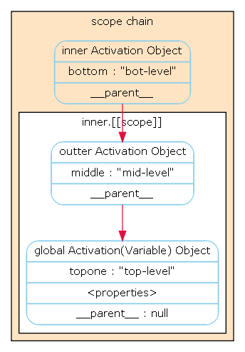

### 作用域

作用域分 全局作用域和局部作用域

	1. 全局作用域 在浏览器上 window 在node的上global 在这个里面定义的变量 有全局的作用域
	2. 局部作用域 在函数里面定义的变量有着局部作用域
	3. 局部作用域里面可以获取到全局作用域的变量，全局的作用域则不能访问局部的变量

```javascript

var a=100;
var b=50;
function add(){
	var c=100;
	//在add函数局部变量里面就可以看到全局的a b 
	console.log(a+b);	
}
add();
//在全局里面就看不到局部的变量c 
console.log(c)


```

提示：

		150
		Uncaught ReferenceError: c is not defined
    	at index.html:12

执行add 可以得到函数外面的A和B的值但是在外面得不到C的值

### 作用域链

在局部作用域中可以看到全局的作用域，在局部里面的函数，又可以看到局部的作用域。

当js需要查找变量x的时候，（变量解析），他会从链中的第一个对象开始找，如果第一个对象不存在名为X的属性，js会继续向上找链的下一个对象。如果第二个对象中依然没有名为X的属性。则会继续找下一个。
以此类推。如果作用域链上没有一个对象含有属性X，那么就认为这段代码的作用域链上没有X 抛出错误异常。

js最顶层，作用域链由一个全局对象组成。在不包含嵌套的函数体内，作用域链上有两个对象，第一个定义了函数参数和局部变量的对象。第二个就是全局对象。在一个嵌套的函数体内，作用域链上至少有三个对象。

 理解作用域链的创建规则是非常重要的。当定义一个函数时，它实际上保存了一个作用域链。
当调用这个函数时，他创建一个新的对象（活动对象）来储存它的局部变量，并将这个对象添加保存的那个作用域链上，同时创建一个新的更长的表示函数调用作用域的“链”。

对嵌套函数来说更有趣，每次调用外部函数的时候，作用域连都是不同的。内部函数在每次定义时候都有微妙的差别--每次调用外部函数的时候，内部函数代码相同，关联这段代码的作用域链不同。

```javascript
  var topone = "top-level";    
   (function outter(){  
       var middle = "mid-level";  
       (function inner(){  
          var bottom = "bot-level";            
          print(topone+">"+middle+">"+bottom);  
      })();  
   })();  
//这个函数的作用域链为下图
```

